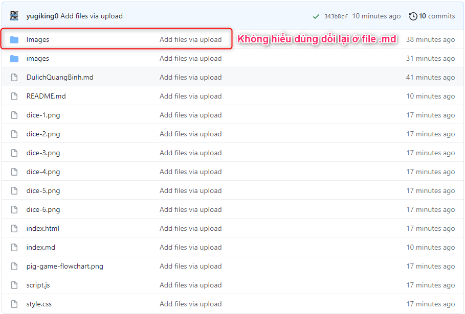
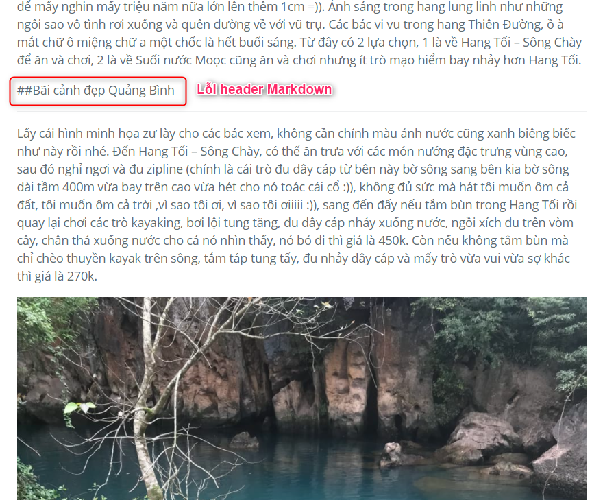
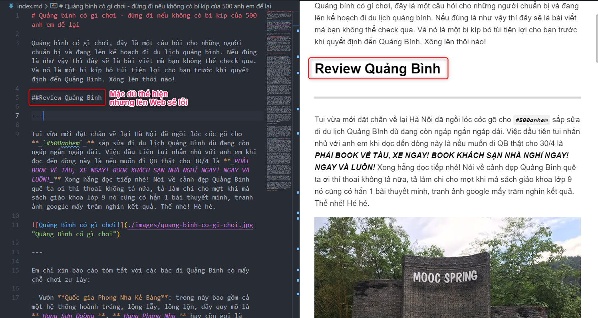
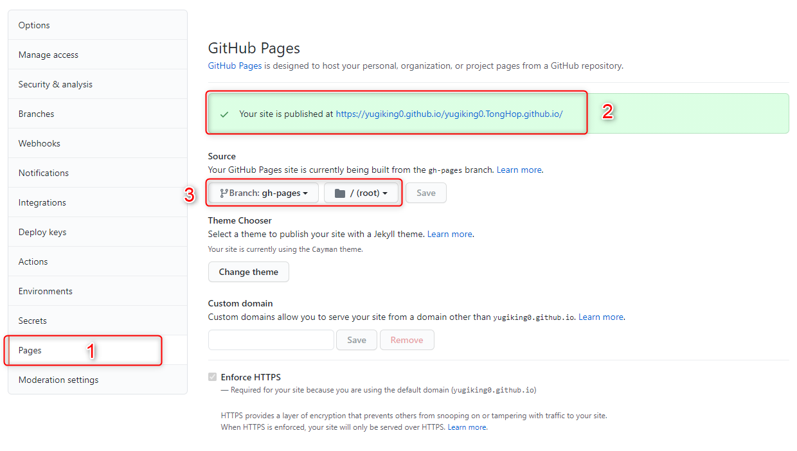

# Chú ý khi làm Page GitHub

## Header phải có khoản cách

```js
### Cách ra
không dùng
###Không cách => Sai
```



## Thư mục hình ảnh images hoặc các thư mục

- Phải được viết thường, không được viết hoa chữ cái đầu sẽ bị sai không hiểu link Markdown





- Khai báo port page ở nhánh.


