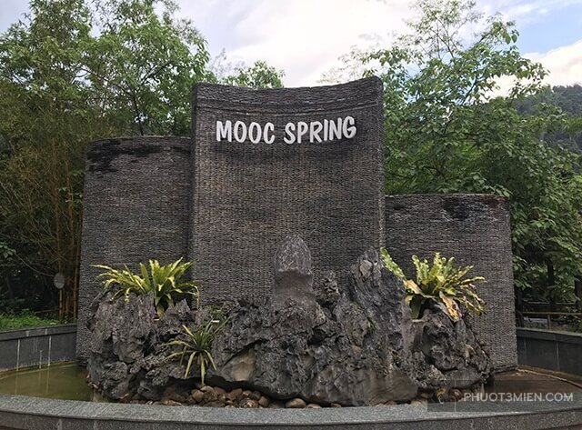
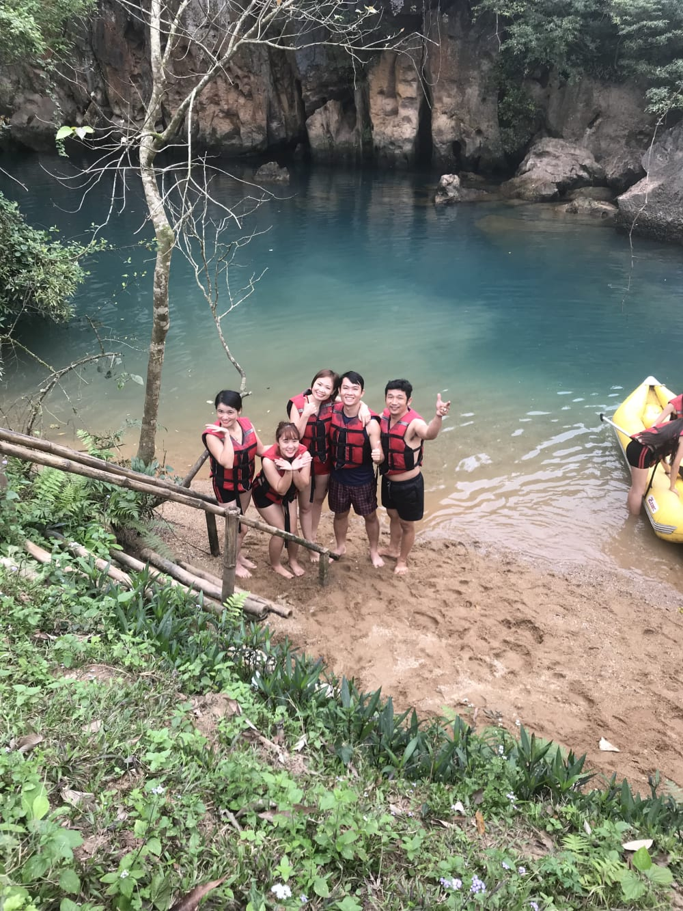

# Quảng bình có gì chơi - đừng đi nếu không có bí kíp của 500 anh em để lại

Quảng bình có gì chơi, đây là một câu hỏi cho những người chuẩn bị và đang lên kế hoạch đi du lịch quảng bình. Nếu đúng là như vậy thì đây sẽ là bài viết mà bạn không thể check qua. Và nó là một bi kíp bỏ túi tiện lợi cho bạn trước khi quyết định đến Quảng Bình. Xông lên thôi nào!

## Review Quảng Bình

---

Tui vừa mới đặt chân về lại Hà Nội đã ngồi lóc cóc gõ cho **_`#500anhem`_** sắp sửa đi du lịch Quảng Bình dù đang còn ngáp ngắn ngáp dài. Việc đầu tiên tui nhắn nhủ với anh em khi đọc đến dòng này là nếu muốn đi QB thật cho 30/4 là **_PHẢI BOOK VÉ TÀU, XE NGAY! BOOK KHÁCH SẠN NHÀ NGHỈ NGAY! NGAY VÀ LUÔN!_** Xong hẵng đọc tiếp nhé! Nói về cảnh đẹp Quảng Bình quê ta ơi thì thoai không tả nữa, tả làm chi cho mợt khi mà sách giáo khoa lớp 9 nó cũng có hẳn 1 bài thuyết minh, tranh ảnh google mấy trăm nghìn kết quả. Thế nhé! Hé hé.

---

Em chỉ xin báo cáo tóm tắt với các bác đi Quảng Bình có mấy chỗ chơi zư lày:

- Vườn **Quốc gia Phong Nha Kẻ Bàng**: trong này bao gồm cả một hệ thống hoành tráng, lộng lẫy, lồng lộn, đầy quy mô là **_Hang Sơn Đoòng_**, **_Hang Phong Nha_** hay còn gọi là (động nước) hang **_Tiên Sơn_** (động khô), Hang Thiên Đường, Hang Tối, Hang Và, Hang Tú Làn, Suối nước Moọc…)
- Biển Nhật Lệ, biển Bảo Ninh, biển Đá Nhảy: chỗ nào cũng đẹp, nước xanh trong vắt, thỉnh thoảng thấy cá nhảy tung tăng quanh người he he
- Khu lăng mộ Đại tướng Võ Nguyên Giáp: riêng nơi này vừa mang đậm yếu tố lịch sử thành kính, vừa có cảnh đẹp thiên nhiên thơ mộng, non nước hữu tình.

3 cái gạch đầu dòng thôi nhưng mà đi cũng hết hơi đấy ạ, đẹp quá mà :D Vì có nhiều chỗ chơi và giá rất khác nhau, tiêu biểu là hang **_`Sơn Đoòng`_** thì anh em cố cày cuốc kiếm tiền, rồi book chỗ, rèn luyện thể lực 3 năm sau đi ạ, còn hang Tú Làn thì tour của nó giá từ 5,5 triệu đến 14 triệu[1] cũng là kiểu thám hiểm, bơi lội leo trèo, trông rất nhà nghề. Em recommend nếu các bác có khoảng 2-3 triệu thì nên đi zư lày:

## Kinh nghiệm du lịch Quảng Bình 4 ngày 3 đêm

---

Đi từ Hà Nội vào trung tâm thành phố Đồng Hới đi bằng xe giường nằm Hưng Long, giá vé ngày thường là 200k/ lượt và 250k/lượt cho ngày lễ. Xe xuất phát ở Mỹ Đình và Trần Khát Chân nhé. Như vậy cả đi cả về mới hết 500k, các bác đi tàu sẽ đắt hơn nhiều ạ. Vào đến nơi nên ở khách sạn, nhà nghỉ gần biển. Tốt nhất là trên đường Quách Xuân Kỳ, Nguyễn Du, Trương Pháp (thực ra nó đều là 1 đường ven biển) vì vừa rất gần biển, vừa gần các tuyến xe bus đi đến các điểm du lịch, gần chợ Đồng Hới. Buổi sáng dậy sớm, đi bộ dọc bãi biển ngắm bình minh, hít hà mùi của biển, của gió, của hải sản được phơi khô dưới ánh nắng sớm mai. Đấy, thế mới là tận hưởng hi hi.

Trên cung đường này rất nhiều nhà hàng hải sản, quán cà phê nhỏ nhỏ xinh xinh, quán bar tùm lum tà la. Trong thành phố có 2 quán được báo chí kể đi kể lại kể mãi kể hoài là Coco Cà phê (đường Nguyễn Hữu Cảnh) và Fcoffee (đường Trần Quang Khải) dựa theo kiến trúc hài hòa giữa nước và tre, cây cối yên bình. Ngoài ra thêm 1 quán lạ lạ nữa có nhạc sống trong không gian cực chất Adam & Eva (52 Lê Văn Hưu) nhé (nghe bảo tối nào cũng có nhạc luông). Nhiều sự lựa chọn thế cơ mà ^^ Ngày đầu tiên ở Quảng Bình, em nghĩ các bác không nên bắn đi Phong Nha ngay vì khá là mệt. Tốt nhất là chơi loanh quanh trong thành phố. Sáng đến thì nghỉ ngơi rồi biển, đi cà phê, chiều đi ăn, có thể ăn bánh lọc Mệ Xuân ở đường Lê Thành Đồng, ốc chiên sau lưng trường đại học Quảng Bình. Ốc chiên ạ, phải dừng lại đây chỉ để kể về ốc chiên.

Nó là món siêu ngon đối với em trong cái cuộc đời này. Ốc béo ngậy xào chung với dừa, dứa, lá chanh, củ sả, tập mỡ, ớt tươi. Tất cả các vị hòa quyện với nhau thấm đến tận từng tế bào luôn. Vừa chua đằm, vừa ngọt thanh, vừa cay nồng, vừa béo béo, giòn giòn dai dai. Ăn xong không ai dám nói câu nhạt như nước ốc nữa he he. Hoặc đi tắm biển, nô đùa với con sóng, nghịch cát vàng lóng lánh đa cạnh. Các bác mà nhiều tiềng thì sang khu Sun Spa resort thuê mấy cái xe máy nước hoặc nhảy dù các thứ.

Ăn tối bằng một bữa bánh bèo, bánh khoái thịt nướng với nước lèo rau sống, hoặc bánh ướt tôm chấy ở quán Tứ Quý, trên đường Cô Tám gần chợ Đồng Hới. Sau đó đi bộ lên cầu Nhật Lệ hóng gió, ăn cóc xoài dầm. Đến đây vẫn phải ăn nhé, vì cóc ổi dầm ở đây nó không như Hà Nội đâu ạ. Tương truyền cóc ổi được dùng nước chè xanh hãm nhẹ để dầm đới hé hé. Ngày thứ 2, các bác phải dậy thiệt sớm nhé, lên Phong Nha nó mới đỡ tắc đường, đỡ chen nhau cho các bác đi chơi thoải thích. Chứ mà dậy tầm muộn muộn, nắng tót lên ngọn dừa rồi mới tung tăng lúc lên đấy chỉ có phơi nắng vì đợi í. Các bác bắt xe buýt B4 ở ngay chỗ cầu Nhật Lệ, hoặc trên quốc lộ 1A chỗ bưu điện tỉnh.

Xe sẽ đưa các bác đến với khu Phong Nha Kẻ Bàng sau khi vượt qua 54km. Mỗi người chỉ hết có 30k xe bus. Đến đấy các bác có thể thăm hang Phong Nha. Ở hang này chủ yếu di chuyển bằng thuyền và thưởng ngoạn khung cảnh hai bên bờ, trong hang. Cảm giác sẽ như đi Tràng An của Ninh Bình vầy đó. Còn nếu đi động Tiên Sơn sẽ đi thuyền một đoạn, sau đấy leo bộ khá là cao và xa, trong hang cũng dài và kỳ vĩ lắm ạ. Giá vé vào động nước là 150k và động khô chỉ 80k. Tuy nhiên, em thì em không suggest các bác đi 2 hang này dù nó đẹp lắm, tuyệt vời lắm bởi có 1 hang đáng đi hơn rất nhiều mà không quá đắt. Đó là hang Thiên Đường. Từ khu Phong Nha, đi taxi/ xe ôm/xe máy thêm khoảng 20km nữa là đến.

Đây mới gọi là nơi thật sự kỳ diệu và tuyệt vời mà túi tiền của chúng ta có thể chạm tới. Vé vào hang là 250k. Các bác cũng phải leo rất rất nhiều bậc mới có thể đến được Thiên Đường ạ. Lên Thiên Đường hem có dễ hê hê. Vào phía trong hang, mát rượi từng lỗ chân lông, thở hổn hển rồi nhìn khung cảnh kì diệu, lung linh của tạo hóa mở ra trước mắt, mới thấy cái cuộc đời mấy chục năm của mình không xứng được làm một cái chấm trên hành trình kiến tạo của thiên nhiên. Các thạch nhũ lớn bé ở khắp nơi, từ trên vòm hang hay ở dưới chân mình.

Mỗi thạch nhũ mỗi dáng vẻ, yêu kiều có, thô ráp có, đường bệ uy nghiêm có hay cả những miếng thạch nhũ bé xinh màu ngọc trong veo đang tiếp tục hứng những giọt nước từ trần hang rơi xuống, để mấy nghin mấy triệu năm nữa lớn lên thêm 1cm =)). Ánh sáng trong hang lung linh như những ngôi sao vô tình rơi xuống và quên đường về với vũ trụ. Các bác vi vu trong hang Thiên Đường, ồ à mắt chữ ô miệng chữ a một chốc là hết buổi sáng. Từ đây có 2 lựa chọn, 1 là về Hang Tối – Sông Chày để ăn và chơi, 2 là về Suối nước Moọc cũng ăn và chơi nhưng ít trò mạo hiểm bay nhảy hơn Hang Tối.

##Bãi cảnh đẹp Quảng Bình

---

Lấy cái hình minh họa zư lày cho các bác xem, không cần chỉnh màu ảnh nước cũng xanh biêng biếc như này rồi nhé. Đến Hang Tối – Sông Chày, có thể ăn trưa với các món nướng đặc trưng vùng cao, sau đó nghỉ ngơi và đu zipline (chính là cái trò đu dây cáp từ bên này bờ sông sang bên kia bờ sông dài tầm 400m vừa bay trên cao vừa hét cho nó toác cái cổ :)), không đủ sức mà hát tôi muốn ôm cả đất, tôi muốn ôm cả trời ,vì sao tôi ơi, vì sao tôi ơiiiii :)), sang đến đấy nếu tắm bùn trong Hang Tối rồi quay lại chơi các trò kayaking, bơi lội tung tăng, đu dây cáp nhảy xuống nước, ngồi xích đu trên vòm cây, chân thả xuống nước cho cá nó nhìn thấy, nó bỏ đi thì giá là 450k. Còn nếu không tắm bùn mà chỉ chèo thuyền kayak trên sông, tắm táp tung tẩy, đu nhảy dây cáp và mấy trò vừa vui vừa sợ khác thì giá là 270k.

Thêm cái nữa, ở sông Chày và suối nước Moọc, các bác có thể vừa tắm, vừa chơi, vừa ngắm bướm trắng bướm vàng bay từng đàn quấn quýt bên mình như kiểu công túa Hàm Hương ấy. Em thề em không nói điêu! Nhỡ mà nó không quấn quýt quanh các bác phải chăng do mùi cơ thể =)) Rồi các bác chơi đến lúc nào mệt quá rồi thì đi về ạ :D Chèo thuyền Kayak nè, ảnh hơi mờ do nước bám vào mặt ngoài túi chống nước hế hế Còn với suối nước Moọc, các bác cũng có thể ăn trưa gà nướng với xôi các kiểu, rồi tắm suối, chèo thuyền kayak, ngồi uống cà phê trong quán tổ chim ngắm dòng nước xanh ngắt và những đoạn nước chảy mạnh trên gò đá trắng xóa. Đến đây chụp ảnh và nghỉ ngơi bỗng chốc quên mất Hà Nội là nơi nao, có cần về nữa không he he. Giá vào suối chưa kể ăn uống là 180k ạ. Ôi zồi ôi, lowtech không biết nhúng clip vào làm sao cho sống động. Em khuyên các bác đang tuổi ăn tuổi chơi nên đi hang Thiên Đường rồi về hang Tối - sông Chày, vừa có thể khám phá vừa chơi tẹt ga.

Còn các bác thích sự thư thái, ung dung hòa hợp với thiên nhiên thì chọn Thiên Đường và suối nước Moọc, về cũng đủ làm vài bài thơ tặng hàng xóm ạ. Sau đấy, lại đi taxi về Phong Nha và đi xe bus về trung tâm thành phố Đồng Hới. Chơi mệt rồi, ta ra biển oánh chén hải sản cho sướng cái bụng thôi. Sang ngày thứ 3, các bác lại đi xe bus đến ngã ba Ba Đồn rồi đi taxi thêm 26km nữa sẽ đến khu lăng mộ đại tướng Võ Nguyên Giáp. Khi đi nhớ mặc lịch sự chút nhé. Trên đường vào lăng sẽ có hoa cúc vàng để mình mua, không cần mang từ nhà. Thăm mộ xong có thể đi bộ xuống biển ngắm những phiến đá nằm phơi mình ngễn mặt giữa đất trời. Nước biển ở đây trong vắt lăn tăn dịu dàng như hơi thở của gióa. Sau đấy trở về thành phố ăn trưa. Chiều dung dăng đi chợ Đồng Hới thu mua hải sản hé hé. Tối lại đi về Hà Nội thoai.

Cơ bản lịch trình như thế theo em là hợp lý với lứa tuổi chúng mình. Có mấy điều lưu ý: - Vì di chuyển giữa các điểm hang Thiên Đường, hang Tối khá là xa nên nếu đi tầm 5 người thì đi xe bus, xe ôm, đừng nên thuê xe máy vì phượt thời tiết này rất mệt. Trời rất nắng, nóng, gió Lào quật rát mặt lắm ạ, không đùa được đâu. Nếu đi đông người nên thuê xe ô tô để di chuyển luôn, đỡ tiền taxi các thứ. Đâu tầm 1 triệu rưỡi 2 triệu cho xe 12 chỗ ngồi thì mình chủ động các điểm đến. Đi kiểu gia đình tốt nhất là thuê xe để đảm bảo cho các em bé và ông bà ạ. - Nhớ mang theo túi chống nước cho điện thoại, máy ảnh để còn vừa bơi vừa chụp, vừa nhảy xuống nước vừa quay phim.

Nhiều người vừa `ziplining` vừa cầm gậy selfie ngay trên không trung, có vẻ hay cơ mà chắc không tiện khi cầm gậy vô tắm bùn ^^ - Ai cận loạn tùm lum như em nên dắt theo cái dây vào kính treo vào cổ không là lúc nhảy xuống nước rồi trồi lên chả thấy thiên nhiên hùng vĩ đâu nữa. - Các bác không biết bơi ơi, đừng sợ! Đã có áo phao xịn, mũ bảo hiểm, dây cáp các thứ.

Các bác có muốn chìm cũng không dễ. Xung quanh suối rất nhiều phao nữa ạ! Ba em bảo dưới suối có cả lưới, trong trường hợp các bác làm thợ lặn bất đắc dĩ người ta cũng vớt các bác lên như vớt cá được ạ =)) - Kem chống nắng cho cả nam và nữ, không là đen thui như củ khoai nướng chỉ tòi 2 con mắt về kể chuyện ạ =)) - Các bác cũng nhớ bảo vệ môi trường nữa nhé, đừng vứt rác lung tung làm mất mặt người thủ đô nhé he he. Tổng chi phí em nghĩ sẽ ít nhất là 2 triệu rưỡi là ô kê rầu. Cho kinh nghiệm du lịch Quảng Bình 2 ngày 1 đêm

**Nguồn: Hoàng Thảo Anh**
